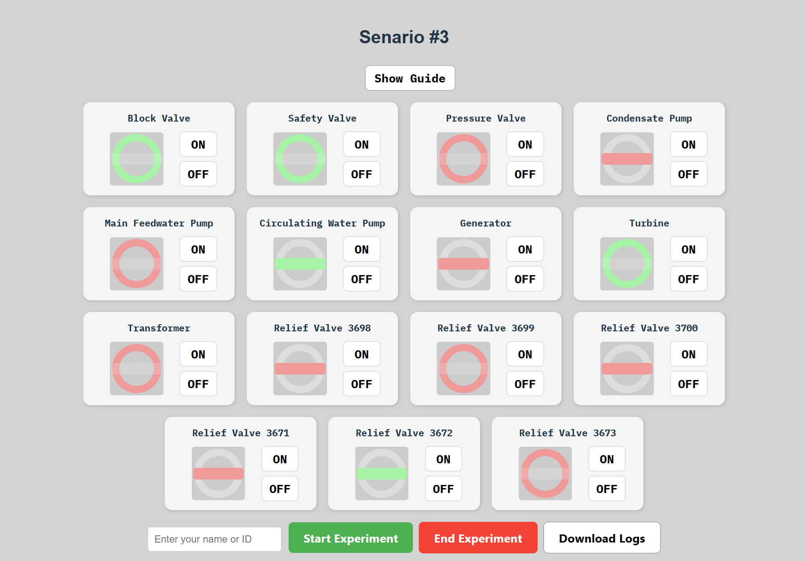

# 💡 VISCUE - Visual Interactive Simulation Control User Environment

VISCUE is a web-based HMI simulation framework designed for experimental interface control and user decision tracking. It simulates control panels similar to those used in high-reliability systems (e.g., nuclear power plants), allowing toggling of operational states, visual feedback, and log collection.

## 🖼 Interface Preview

<p align="center">
  
</p>

---

## 📦 Installation Instructions

Follow the steps below to set up the Conda environment and start the project:

```bash
# 1. Create Conda environment with Python + Node.js
conda create -n viscue python=3.10 nodejs=18 -y
conda activate viscue

# 2. Create project using Vite + React
cd ~/Desktop
mkdir viscue
cd viscue
npm create vite@latest viscue -- --template react
cd viscue
npm install

# 3. Start development server
npm run dev
```

---

## 🚀 How It Works

### 🔧 Control Interface
- Each device can be toggled ON/OFF with immediate visual updates.
- ON = Red (`🔴`), OFF = Green (`🟢`)
- Devices are visually grouped 5 per row for consistency.

### 📋 Initial State Sets
- Defined in `src/data/initialStates.js`
- Selectable via a dropdown menu at the top of the UI.

### 🎯 Target Goal State
- The target goal state is defined and can be previewed by clicking the **Show Goal** button.
- A new browser window will open and display the expected final state using `goal.html`.
- Target state is passed via `localStorage` under the key `goalState`.

### 💾 Log Collection
- All toggle actions and mouse movements are recorded.
- Clicking **Download Logs** generates a `log_YYYYMMDD_HHMMSS_name.json` file.
- Example log structure:

```json
{
  "interface": "#1",
  "selectedInitialState": "Set A",
  "participant": "your_id",
  "log": [
    { "type": "toggle", "label": "Block Valve ON", "time": 1682918300000 },
    { "type": "mousemove", "x": 512, "y": 210, "time": 1682918300500 }
  ]
}
```

### 🪟 Popup Goal Display (goal.html)
- Found in `public/goal.html`
- Displays target state from localStorage
- Designed for side-by-side reference during experiments

---

## 🛠 How to Modify

- **Initial state configuration** → `src/data/initialStates.js`
- **Target goal display (popup)** → `public/goal.html`
- **UI styling** → `src/styles/ui.css`
- **Display panel rendering** → `src/components/DisplayGrid.jsx`
- **Control buttons rendering** → `src/components/ControlGrid.jsx`
- **Logging logic** → `App_[Scenario].jsx`

---

## 🌐 Deployment

VISCUE is built with Vite and can be deployed on static hosting services like Netlify or Vercel.

```bash
npm run build  # Builds project to the dist/ folder
# Upload dist/ to Netlify or deploy via Vercel CLI
```

---

## 🧰 Tech Stack
- Vite + React
- JavaScript (ES6)
- CSS Modules
- Conda (for integrated Python + NodeJS setup)

---

🔗 Live Demo: [vis-cue.vercel.app](https://vis-cue-ss-projects-d534f65d.vercel.app/)
📂 Source Code: [github.com/separk-1/viscue](https://github.com/separk-1/viscue)

